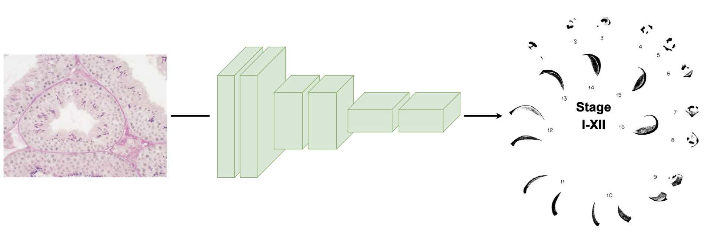

# STSP: Seminiferous Tubule Stages Prediction

[](https://doi.org/10.1101/2024.08.07.606973)

This is the code for our paper [Deep learning based automated prediction of mouse seminiferous tubule stage by using bright-field microscopy](https://doi.org/10.1101/2024.08.07.606973). 
This project is carried out in [Funahashi Lab. at Keio University](https://fun.bio.keio.ac.jp/).


## Overview

Our model performs to predict the stage from bright-field microscope images of mouse seminiferous tubules, in which there are 12 developmental stages.
The maximum prediction accuracy of our model is 79.58%, which increases to 98.33% when a prediction error of ±1 stage is allowed.


Note: This overview figure is adapted from figures in (Oakberg, E. F., American Journal of Anatomy, 1956).


## Requirements

- [Python 3.7.6+](https://www.python.org/downloads/)
- [Pytorch 1.9.0＋](https://pytorch.org/)
- [Torchvision 0.10.0＋](https://pytorch.org/vision/stable/index.html)
- [Matplotlib 3.5.3](https://matplotlib.org/)
- [NumPy 1.21.6+](http://www.numpy.org)
- [SciPy 1.7.3+](http://www.scipy.org)
- [Pandas 1.3.5+](https://pandas.pydata.org/)
- [scikit-image 0.16.1+](http://scikit-image.org/)
- [scikit-learn 1.0.2+](http://scikit-learn.org/)
- [pytz 2023.3+](https://pythonhosted.org/pytz/)
- [tqdm 4.65.0+](https://tqdm.github.io/)

See ```requirements.txt``` for details. 


## QuickStart

1. Download this repository by `git clone`.
   ```sh
   % git clone git@github.com:funalab/STSP.git
   ```
2. Install requirements.
   ```sh
   % cd STSP/
   % python -m venv venv
   % source ./venv/bin/activate
   % pip install --upgrade pip
   % pip install -r requirements.txt
   ```
3. Download datasets and learned model.
   - On Linux:

      ```sh
      % wget -O models.tar.gz "https://drive.usercontent.google.com/download?id=1nht6tVhA4aCNeCQj2r9zk67J0cHeBpYe&confirm=xxx"
      % tar zxvf models.tar.gz
      % wget -O datasets.tar.gz "https://drive.usercontent.google.com/download?id=1XwMSSAH1xMW0vwHoEobP2iyjrn4eSNZa&confirm=xxx"
      % tar zxvf datasets.tar.gz
      ```

   - on macOS:
     ```sh
     % curl --output models.tar.gz "https://drive.usercontent.google.com/download?id=1nht6tVhA4aCNeCQj2r9zk67J0cHeBpYe&confirm=xxx"
     % tar zxvf models.tar.gz
     % curl --output datasets.tar.gz "https://drive.usercontent.google.com/download?id=1XwMSSAH1xMW0vwHoEobP2iyjrn4eSNZa&confirm=xxx"
     % tar zxvf datasets.tar.gz
     ```
4. Run the model.

    The following command will run the test on the GPU (`device=cuda:0`).
    If you want to run on CPU, open `confs/test_resnet.cfg` and rewrite `device=cpu`.
    ```sh
    % python -W ignore src/tools/test.py --conf_file confs/test_resnet.cfg
    ```
    The above command is for ResNet, but if you want to run other models (ResNeXt, WideResNet, MobileNetV3), specify `confs/test_resnext.cfg`, `confs/test_wide_resnet.cfg`, `confs/test_mobilenetv3.cfg`, respectively.


## How to train and run model with your data

1. At first, prepare the dataset following the directory structure as follows:

    ```
    your_dataset/
           +-- images/  (train, validation, and test images)
           |       +-- image_1-1.tif  (stage 1)
           |       +-- image_1-2.tif  (stage 1)
           |       +-- image_2-1.tif  (stage 2)
           |       |         :        
           |       |         :        
           |       +-- image_12-14.tif  (stage 12)
           |       +-- image_12-15.tif  (stage 12)
           | 
           +-- split_list/
           |           +-- train.txt        (List of file names for train images)
           |           +-- validation.txt   (List of file names for validation images)
           |           +-- test.txt         (List of file names for test images)
           +-- label_list.txt
    ```
    The file name of the image must end with `{stage}-{index}.tif`.
    Specifically, {stage} should be the number (stage) given in `label_list.txt`. {index} is any number.
    `split_list/train.txt`, `split_list/validation.txt`, and `split_list/test.txt` should be the filenames of images used in train, validation, and test phase, line by line.


2. Train model with the above-prepared dataset.
    
    The following command will run the training with the settings in the config file specified by `--conf_file`.

    ```sh
    % python -W ignore src/tools/train.py --conf_file confs/train_resnet.cfg
    ```

    We prepared the following options for training in the config file.

    ```
    [Dataset]
    root_path                               : Specify directory path for dataset contained train, validation, and test.
    split_list_train                        : Specify the path of the split_list file for train.
    split_list_validation                   : Specify the path of the split_list file for validation.
    label_list                              : Specify the path of the label_list file.
    basename                                : Specify directory name for images
    crop_size                               : Specify the (x, y) pixel size to crop from the image.
    crop_range                              : Specify the pixel range to crop from the center of the image.
    convert_gray                            : If True, converts the input image to gray scale.
    
    [Model]
    model                                   : Specify model type {"resnet", "resnext50_32x4d", "wide_resnet50_2", "mobilenet_v3_large"}
    init_classifier                         : Specify the path to the checkpoint file if you want to resume the training.
    pretrained                              : If True, the weights of the train model are used as the initial weights.
    n_input_channels                        : Specify the number of input image channels.
    n_classes                               : Specify the number of classes of output.
    lossfun                                 : Specify the loss function.
    eval_metrics                            : Specify metrics for evaluation.
    
    [Runtime]
    save_dir                                : Specify output files directory where model and log file will be stored.
    batchsize                               : Specify minibatch size for training.
    val_batchsize                           : Specify minibatch size for validation.
    epoch                                   : Specify the number of sweeps over the dataset to train.
    optimizer                               : Specify optimizer {Adam, SGD}.
    lr                                      : Specify learning rate for optimizer.
    momentum                                : Specify momentum for optimizer.
    weight_decay                            : Specify weight decay used for the penalty of loss function.
    device                                  : Specify `cuda:[GPU ID]` (or `cpu`).
    seed                                    : Specify random seed.
    phase                                   : Specify the phase {"train", "test"}
    graph                                   : If True, the calculated graph used for training is drawn.
    ```

3. Run model with the above-prepared dataset.

    Specify the path of `best_model.npz` in `results/` directory  generated by training in the option `init_classifier` of `confs/test_resnet.cfg`, and run the following command.
    ```sh
    % python -W ignore src/tools/test.py --conf_file confs/test_resnet.cfg
    ```


## Acknowledgements
The authors thank the suggestions and discussions with Takahiro G. Yamada in Funahashi-lab, Keio University
and Daisuke Mashiko in Research Institute for Microbial Diseases, Osaka University.
This research was funded by JST CREST Grant Number JPMJCR21N1 to M.I. and A.F. The NVIDIA Tesla V100 was used in the miniRAIDEN computer server owned by RIKEN.
